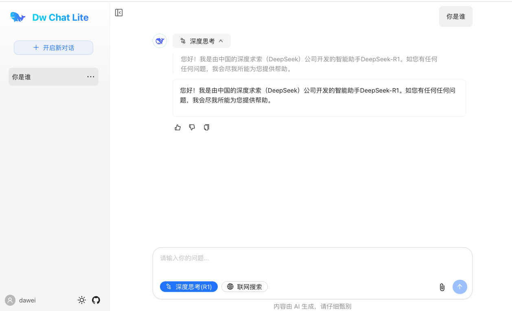

## DW Chat Web Lite(dw-chat-web-lite)

一个接入 DeepSeek-V3、DeepSeek-R1 大模型的纯前端 AI 对话页面.


演示地址：https://dw-chat-lite.dw1898.top

效果图：


#### 主要技术：

1.DeepSeek-V3、DeepSeek-R1 LLM

2.React 19

3.NextJS 15

4.Ant Design X

5.tailwind SCC


### 项目结构

dw-chat-web-lite：纯前端版工程     Github：https://github.com/dawei1898/dw-chat-web-lite

dw-chat-web：前端工程        Github：https://github.com/dawei1898/dw-chat-web

dw-chat：后端工程        Github：https://github.com/dawei1898/dw-chat

dw-chat-next：next 全栈版工程      Github：https://github.com/dawei1898/dw-chat-next


### 本地启动项目

安装依赖
```shell
npm install
```

启动项目

```bash
npm run dev
```

打开项目 http://localhost:3000


### 本项目用到的库

安装 Ant Design
```shell
npm install antd --save
```

安装 Ant Design X
```shell
npm install @ant-design/x --save
```

安装 Ant Design icon图标
```shell
npm install @ant-design/icons --save
```

安装 ProComponents
```bash
npm i @ant-design/pro-components --save
```

兼容 React 19
```shell
npm install --save-dev @ant-design/v5-patch-for-react-19
```

在应用入口处引入兼容包
```ts
import '@ant-design/v5-patch-for-react-19';
```

安装 @ant-design/nextjs-registry，解决antd组件页面闪动的情况
```bash
npm install @ant-design/nextjs-registry --save
```

安装 openai
```shell
npm install openai
```

安装 markdown-it
```shell
npm install markdown-it --save
npm install @types/markdown-it --save-dev
```

代码高亮
```shell
npm install highlight.js
```
高亮样式
```ts
import 'highlight.js/styles/atom-one-light.css';
```

复制
```shell
npm install clipboard-polyfill
```